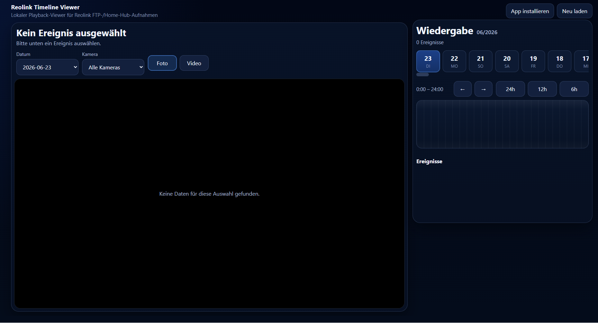

```markdown
# Reolink Timeline Viewer


Local playback viewer for Reolink FTP/Home Hub recordings.



## ✨ Features

- 🎥 Timeline playback for Reolink recordings
- 📷 Photo and video event view
- 📅 Date based event navigation
- 🎛️ Camera filter
- 📱 Progressive Web App (PWA)
- 🐳 Docker and Docker Compose support
- ☁️ Cloudflare Tunnel support
- 🔀 Nginx Proxy Manager support
- 📂 FTP/Home Hub recording support
- 🌐 Custom base path support, for example `/reolink`
- ⚡ Responsive dark UI
```
